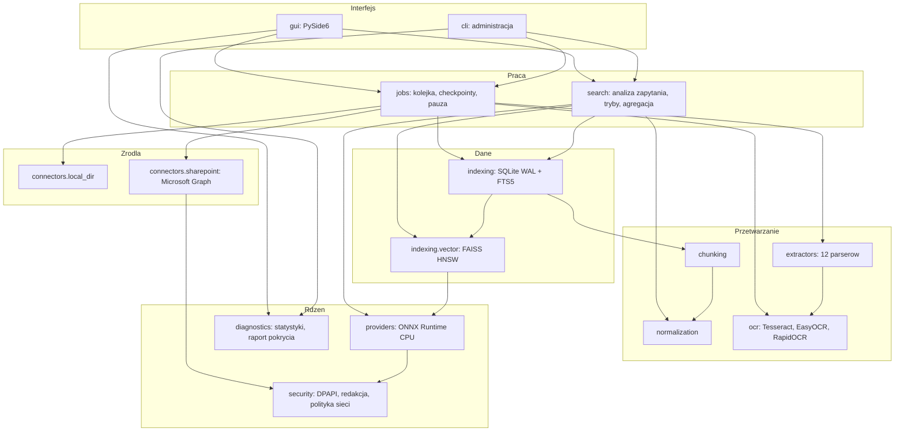
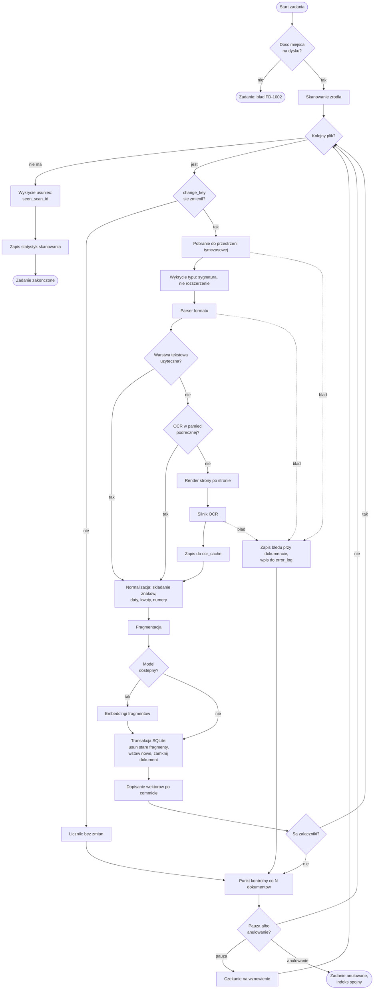
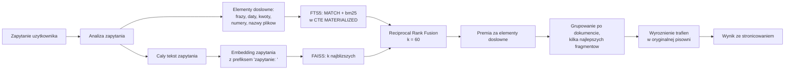

# Architektura

FindDocs jest aplikacją jednoprocesową na Windows 11. Nie ma serwera, usługi
systemowej ani bazy zewnętrznej. Wszystko dzieje się w procesie użytkownika,
na jego danych i z jego uprawnieniami.

## Zasady, z których wynika reszta

1. **Lokalnie.** Dokumenty, zapytania i wektory nie opuszczają komputera.
   Jedyny dozwolony ruch to Microsoft Graph i jednorazowe pobranie modelu,
   oba włączane świadomie.
2. **Tylko CPU.** Sesje ONNX Runtime tworzy się z jawną listą
   `["CPUExecutionProvider"]` i weryfikuje po utworzeniu, bo ORT domyślnie
   wystawia także `AzureExecutionProvider`.
3. **Bez terminala dla użytkownika.** CLI istnieje dla administracji i testów.
4. **Wyszukiwarka, nie asystent.** Aplikacja nie generuje odpowiedzi, nie
   streszcza i nie zawiera modelu językowego typu LLM.
5. **Kompletność albo jasna informacja o jej braku.** Tryb dokładny gwarantuje
   pełny zbiór. Tryby z wektorami mówią wprost, że są przybliżeniem.

## Warstwy

Import może iść tylko w dół. Warstwy komunikują się przez protokoły
zadeklarowane w plikach `base.py`, więc każdy parser, silnik OCR, konektor
i dostawca embeddingów da się wymienić bez ruszania warstw wyższych.

```
gui
 └─ jobs, search
     └─ indexing
         └─ chunking, normalization
             └─ extractors, ocr
                 └─ connectors
                     └─ core (types, errors, config, app_paths, logging_setup, security)
```

### Diagram komponentów



### Przepływ indeksowania



Kluczowe własności tego przepływu:

* **Izolacja błędów na trzech poziomach.** Błąd jednego załącznika nie psuje
  wiadomości, błąd jednego dokumentu nie psuje zadania, błąd jednego źródła nie
  psuje pozostałych. Uszkodzony PDF kończy się wpisem w `error_log`, a nie
  przerwaniem indeksowania.
* **Aktualizacja dokumentu jest atomowa.** Usunięcie starych fragmentów
  i wstawienie nowych dzieje się w jednej transakcji. Nie ma stanu, w którym
  dokument ma połowę starej i połowę nowej treści.
* **Wektory po zatwierdzeniu transakcji.** Gdyby zapis wektorów zawiódł,
  dokument zostaje w stanie `partial`: da się go znaleźć dokładnie, ale nie
  semantycznie. To stan opisany, a nie ukryty.
* **Punkt kontrolny co `checkpoint_every` dokumentów.** Zamknięcie aplikacji
  w trakcie pracy kosztuje najwyżej tyle dokumentów.

### Przepływ wyszukiwania



Tryb dokładny pomija gałąź wektorową i liczy pełny `COUNT`, a stronicowanie
robi przez `LIMIT` i `OFFSET` po posortowanym zbiorze. Nie ma ukrytego limitu.

Tryb semantyczny pomija gałąź FTS i zwraca `total_is_exact = false` wraz
z notatką dla użytkownika.

## Decyzje, które łatwo zepsuć

**FTS5 i polskie `ł`.** Tokenizator `unicode61 remove_diacritics 2` składa
znaki diakrytyczne, ale `ł` jest w Unicode osobną literą, a nie `l` ze znakiem.
Dlatego składanie robi aplikacja (`normalization/text.py`), a indeksowana jest
osobna kolumna `folded`.

**bm25 i GROUP BY.** SQLite nie pozwala użyć `bm25()` razem z `GROUP BY` ani
z funkcjami okna, a zwykłe podzapytanie zostaje spłaszczone przez optymalizator.
Zapytania używają więc `WITH ... AS MATERIALIZED`.

**Tokeny znormalizowane muszą być alfanumeryczne.** Tokenizator dzieli tekst na
znakach interpunkcyjnych, więc token z myślnikiem albo dwukropkiem rozpadłby się
na kawałki. Stąd zapis `dat20150724`, a nie `dat:2015-07-24`.

**FAISS HNSW nie usuwa wektorów.** Nie ma `remove_ids`. Usunięcia to nagrobki
w metadanych plus okresowa kompaktacja.

**Model MMLW ma swoje wymagania.** Prefiks `zapytanie: ` dla zapytań, brak
prefiksu dla treści, pooling CLS (nie średnia), normalizacja L2 i metryka
iloczynu skalarnego. Pomylenie któregokolwiek z tych elementów obniża jakość
bez żadnego komunikatu o błędzie.

**ONNX Runtime i providery.** Lista providerów musi być podana jawnie,
inaczej ORT dołoży `AzureExecutionProvider`.

**Wątek główny GUI nie pracuje.** Wyszukiwanie idzie do puli wątków,
indeksowanie do własnego wątku `JobRunner`. Wyniki wracają sygnałami Qt
dostarczanymi w kolejce. Obiekt zadania jest trzymany w rejestrze, dopóki nie
dostarczy wyniku, bo pula usuwa `QRunnable` zaraz po `run`, a zdarzenie
czekające w kolejce wskazywałoby wtedy na zwolnioną pamięć.

## Wybory technologiczne

Uzasadnienia w formie decyzji architektonicznych: [katalog ADR](adr/).

| Obszar | Wybór | Alternatywa odrzucona |
| --- | --- | --- |
| Interfejs | PySide6 (LGPL) | PyQt6 (GPL), Tkinter (wygląd) |
| Pełny tekst | SQLite FTS5 | Whoosh (wolny), Elasticsearch (serwer, Java) |
| Wektory | FAISS HNSW | Chroma, Qdrant (serwer albo zależności) |
| Embeddingi | ONNX Runtime CPU | torch (rozmiar), API zdalne (zakazane) |
| Model | `sdadas/mmlw-retrieval-roberta-base` | patrz [raport PoC](raport-poc.md) |
| PDF | pypdfium2 (BSD, Apache) | PyMuPDF (AGPL) |
| MSG | własny czytnik OLE | extract-msg (GPL-3.0) |
| Dystrybucja | uruchomienie z kodu źródłowego | PyInstaller (proces budowania), pakiet z PyPI (dostęp do sieci) |

## Rozszerzanie

**Nowy format.** Napisz klasę dziedziczącą z `Extractor`, zadeklaruj
`extensions`, `mime_types`, `support_level` i `priority`, zarejestruj ją
w `build_default_registry`. Reszta aplikacji nie wymaga zmian.

**Nowy silnik OCR.** Zaimplementuj protokół z `ocr/base.py` i dopisz go do
listy w `ocr/service.py`.

**Nowe źródło dokumentów.** Zaimplementuj protokół z `connectors/base.py`:
wykrywanie pozycji, pobieranie pliku i klucz zmiany.

**Inny dostawca embeddingów.** Zaimplementuj `EmbeddingProvider` z
`providers/base.py`. Miejsce na wariant korzystający z wewnętrznego API
organizacji jest już przygotowane (`providers/internal_api.py`) i objęte
polityką sieciową jako osobna kategoria ruchu.

**Nowy ekran interfejsu.** Zacznij od `widgets.page.page_layout` i `PageHeader`,
odstępy bierz ze skali w `gui/theme.py`, powtarzalne elementy z `gui/widgets`.
Reguły i powody, dla których interfejs wygląda tak, a nie inaczej, opisuje
[system wizualny](ui-design.md).
